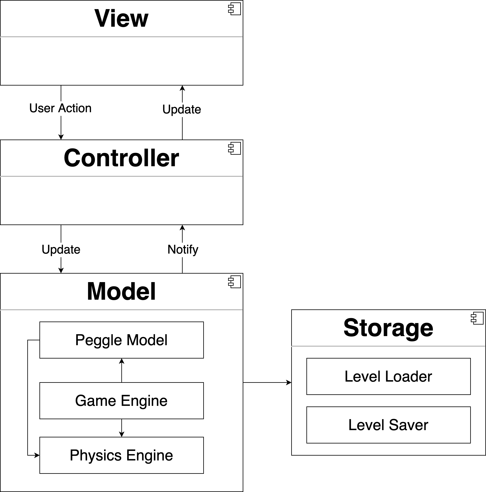
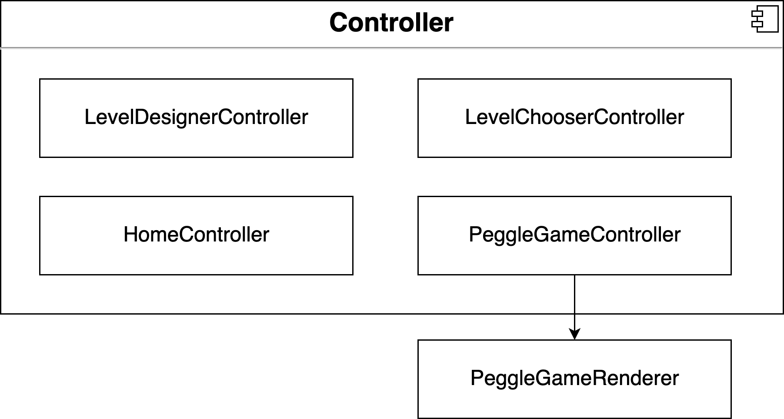

# CS3217 Problem Set 4

**Name:** Tian Fang

**Matric No:** A0194568L

## Credits

1. <a href='https://pngtree.com/freepng/monster-octopus-octopus-monster-cartoon_3920369.html'>octopus png from pngtree.com</a>
2. <a href='https://pngtree.com/freepng/cute-halloween-decorative-pumpkin-lights_4050935.html'>pumpkin png from pngtree.com</a>
3. <a href='https://pngtree.com/freepng/soap-bubbles-vector-bow-reflection-soap-bubbles-aqua-wash-isolated-illustration_5204647.html'>soap bubbles png from pngtree.com</a>
4. <a href='https://pngtree.com/freepng/plastic-bag_5405009.html'>plastic bag png from pngtree.com</a>
5. <a href='https://pngtree.com/freepng/cartoon-fish-vector_2628296.html'>fish png from pngtree.com</a>
6. Float Bubbles png from http://clipart-library.com
7. Sound effects from [https://www.zapsplat.com](https://www.zapsplat.com/)
8. Game Music by Morgan Matthews morganamatthews@yahoo.com
9. Background music from https://www.audiolibrary.com.co

## Dev Guide

### Design

#### Architecture

This Peggle Clone follows the conventional MVC pattern. The *Architecture Diagram* above explains the high-level design of the game. (Note that Constants and Utility classes are omitted.)

Given below is a quick overview of each component:

- `Storage`
  - handle level loading and level Saving

- `Model`
  - represents and stores data related to the game
  - determines rules and logic of the game and expose methods for external use
- `Controller`
  - serves as the bridge between `Model` and `View`
  - accepts user inputs and update `Model` accordingly
  - updates `View` when `Model` changes
- `View`
  - in charge of the representation of data on the screen
  - does not contain any domain logic

#### Interactions between Architecture Components

The *Sequence Diagram* below shows how the components interact with each other when the user **clicks on the SAVE button and inputs a valid level name** when designing a Peggle level.

The *Sequence Diagram* below shows how the components interact with each other when the user **clicks on the screen to launch the ball** when playing a Peggle game.

The sections below give more details of each component.

#### Storage

The `Storage`

- loads all the preloaded levels when the app launches

- retrieves all `json` files in the document directory and load corresponding Peggle levels in alphabetical order
- saves Peggle levels data in `json` format

#### Model

The `Model` contains three parts:

1. `Physics Engine`
   - represents physics objects
   - simulates physics objects' movement and collision
   - detects physics objects' collision with the boundaries of a physics world (which are represented by `Wall`s)
   - does not depend on other sub-components of `Model`
2. `Peggle Model`
   - encapsulates pegs and blocks in the Peggle game using `Peg` and `Block` class
     - `Peg` class have a dependency on the `PhysicsShape` in the `Physics Engine`
     - both `Peg` and `Block` are `PeggleObject`, which is `Oscillatable` (i.e. can move in a simple harmonic way)
   - encapsulates Peggle game levels using `PeggleLevel` class
     - exposes methods that can modify or inspect the state of a `Pegglelevel`

3. `Game Engine`
   - implements Peggle-specific logic - decide how should different game objects interact with each other
   - has `GameEngine` being the main class that inherits from the `PhysicsWolrd`
     - `GameEngine` has a `GameStatus` that stores the current status of the game such as the number of balls left and whether the game has reached an end (represented by `State`)
     - `GameEngine` has a `Master` that determines what power up to trigger when a green peg is hit
   - has `GamePeg` and `GameBlock` to represent `Peg`s and `Block`s  as `OscillatableObject`

Note that the `Model` component does not depend on other components

#### Controller

The `Controller`

- has individual controllers for each of the main screens (e.g. `LevelDesigner`)
- ensures  `Model` and `View` are in sync
- handles gestures such as single tap and call methods from `Model` to update it
- refreshes `View` to show the latest data when there a change to the `Model` (e.g. a peg is deleted)
- specifically, `PeggleGameController` relies on `PeggleGameRenderer` to render views that reflect the current status of `GameEngine`

#### View

The `View`

- has individual view classes that handle the on-screen representations of game elements
- sends user interactions to `Controller`
- specifically, `PegView` and `BlockView` follows three protocols `SelectableView`, `OscillatableView`, and `FadableView` 

### Implementation

Given below are some noteworthy details on how certain features are implemented

#### Ball movement, and collision detection and resolution in Game Engine

When `CADisplayLink` calls the `update` method in `GameEngine`, `MovablePhysicsObject`s other than `Ball`  are moved first (there are no collisions among them). Then the ball will try to detect possible collisions, resolve them, and update positions and velocity correspondingly.

##### Can the ball move freely

The ball will first check a computed property `canMoveFreely`, which checks whether there are any overlapping objects or objects that the ball will collide with. If there are none, then the ball will just `move()`.

##### Remove stuck objects

If the ball cannot move freely, then it will check whether there are any `stuckObjects` (objects that have been hit over 15 times). If there are any, those `stuckObjects` will be removed.

##### Resolve overlaps

After clearing all the stuck objecst, the ball will try to detect and resolve overlaps with other objects. The approach I choose to resolve overlapping is simply moving the ball until there are no overlapping objects. This will effectively prevent strange behaviors if the ball is squashed by two `MovablePhysicsObject`. (Note that using dynamic collision detection which can calculate the exact time and position of the collision is obviously a better solution. However, due to time constraints and the amount of math it involves, I can only resort to my current solution)

##### Collision detection

If there are no more overlapping objects, then the ball's possible future collision is predicted with the help of the function `moveDistance(to:)` method in `MovablePhysicsObject`. It will find the nearest object that it will collide with and try to resolve the collision

##### Collision Resolution

To resolve the collision with object A, the ball will first move to the position where the collision will happen, and then try to calculate the new velocity after the collision. The ball should not `willCollide(with:)` or `overlaps(with:)` object A after the collision. Therefore, the ball might move a small distance after collision if it `willCollide(with:)` or `overlaps(with:)` object A due to floating-point errors.

Note: all `while` loops that could potentially lead to an infinite loop are controlled by a constant `maxNumberOfMovementAdjustment` so that the game will not be stuck.

#### LevelDesignerController

The `LevelDesignerController` controls the level design screen, on which the user can add/delete/move/resize/rotate objects to create their own Peggle level

- Buttons
  - Home button - unwind itself and show the Home Menu
  - Palette
    - Peg buttons for adding peg - switch to "adding peg mode" by setting `selectedPaletteButton`, and the corresponding `PaletteButton`'s method `select()` will be called (to lighten the selected peg button) due to `didSet` of `selectedPaletteButton`
    - Block button for adding block - switch to "adding block mode", similar implementation as Peg buttons
    - Erase button - switch to "deleting object mode" by setting `selectedPaletteButton`
  - Load button - show `LevelChooser` via storyboard segue, and set the `LevelChooser`'s attribute `isLoading` to true so that it knows it should load levels in `Level Designer` instead of playing them
  - Save button - save the current level using save alert from `Alert` class
  - Reset button - reset the level by calling corresponding methods in `PeggleLevel`. The `GameBoardView` will be updated accordingly
  - Start button -  show `PeggleGame` via storyboard segue. The game will be initialized with the current game level using `prepare` method in `LevelDesignerController`
- Gestures
  - Single Tap 
    - if `selectedPaletteButton` is the erase button, delete the object at the tap position, if there is any
    - else
      - if there is an object at the tap position, set `selectedPeggleObject` to that object. And the selected object view will be  `selected()` and change its image due to `selectedPeggleObject`'s `didSet`
      - add a peg/block otherwise if it's valid on the game board
  - Long Press - delete an object if there is one at the Long Pressed position. The `Model` and `View` will be updated accordingly
  - Dragging 
    - if the tap position of dragging is in a Peggle object, then dragging will drag that object around. The position of the dragged peg/block and the corresponding `PegView`/`BlockView` will be updated whenever there is some translation detected by the `UIPanGestureRecognizer`. The peg/block being dragged will be selected.
    - if the tap position of dragging is in a handle of an oscillating Peggle object, then dragging will change the length of the corresponding arrow. Note that the colors may be flipped by dragging a handle across to the opposite side
  - Pinch - resize the `selectedPeggleObject` by the scale detected by the `UIPinchGestureRecognizer` if `selectedPeggleObject` is not nil. The `Model` and `View` will be updated accordingly
  - Rotate - rotate the `selectedPeggleObject` by the angle detected by the `UIRotationGestureRecognizer` if `selectedPeggleObject` is not nil. The `Model` and `View` will be updated accordingly
- Switches
  - Shape switch - the Peg buttons shape will be toggled by calling `toggleShape()` of `PaletteButton`
  - Oscillate switch - the `isOscillating` will be toggled and the period slider will enable/disable accordingly
- Sliders
  - Width slider - change the width of the next block by changing `blockWidth`
  - Height slider - change the height of the next block by changing `blockHeight`
  - Period slider - change the period of the next oscillating object by changing `period`

##### Activity Diagram for Single tap on the game board

#### LevelChooserController

The `LevelChooserController` controls the level selection screen. If the previous screen is `Level Designer`, the selected level will be loaded in the `Level Designer`. If the previous screen is `Home Menu`, then the selected level will be loaded in `Peggle Game` for the user to play. The most important view on the level selection screen is a `UITableView` that lists names of saved levels. Hence, the `LevelChooserController` naturally has to follow two protocols `UITableViewDataSource` and `UITableViewDelegate`, and it's achieved with the help from `LevelLoader`. 

- Buttons
  - Home button - unwind itself and show the Home Menu
- Gestures
  - Tap on a table cell - `currentSelectedLevel` will be updated to the selected level. Note that ` LevelChooserController` detects the previous screen by keeping a variable `isLoading`, based on which it decides which screen it should segue to (if `isLoading` is true, it will unwind itself and show the previous `Level Designer`; otherwise, it will be `Peggle Game`)

#### PeggleGameController

The `PeggleGameController` controls the Peggle game screen. Its main job is to sync the `GameEngine` with the view with the help of `PeggleGameRenderer`. `PeggleGameController` gets notified when there are some changes to the `GameEngine` via the `GameEventHandlerDelegate` protocol. Therefore, `PeggleGameController` implements methods to deal with the respective event that happens in a Peggle game (e.g. if `objectsDidMove()`, then the `renderer` in the `PeggleGameController` will rerender the `GameBoardView`).  `PeggleGameController` has a `TableView` for selecting `Master`s. Hence, the `PeggleGameController` naturally has to follow two protocols `UITableViewDataSource` and `UITableViewDelegate`. 

- Buttons
  - Home button - unwind itself and show the Home Menu
  - Replay button - reset the level for replay. it will reset both the `GameEngine` (model) and `GameBoardView` (view)
- Gestures
  - Pan on the game board - `rotateCannon` will be called and it will calculate the angle in a way that the cannon will always point to the position of the user's finger. Once the angle is calculated, the `CannonView` will rotate correspondingly
  - Tap on the game board - `fireCannon` will be called and it will first ask `GameEngine` whether the user can fire a ball (e.g. cannot fire a ball if the previous ball is still bouncing around). If the ball is ready to be launched, it will call the engine to launch the ball and tell the view to add a `BallView` to the `GameBoardView` accordingly
  - Long Pressing on the game board - if the selected Master is "Mike", the `float()` method in the game engine will be called. If the `floatBubblePercentage` of the current `GameStatus` is greater than zero, then the ball's acceleration will be changed. When the long pressing ends or `floatBubblePercentage` reaches 0, the `unfloat()` method in the game engine will be called and the ball's acceleration will become normal again

## Rules of the Game

Please write the rules of your game here. This section should include the
following sub-sections. You can keep the heading format here, and you can add
more headings to explain the rules of your game in a structured manner.
Alternatively, you can rewrite this section in your own style. You may also
write this section in a new file entirely, if you wish.

### Home Menu

The user can:

- Choose and play a Peggle Game by clicking on the `Play` button
- Design a Peggle Game on their own and play/save the level by clicking on the `Level Design` button (levels that are already saved can be loaded in the `Level Designer` for further changes)
- go back to `Home Menu` by clicking the home icon on screens that are not `Home Menu`

### Level Chooser

- There will be three preloaded levels (that cannot be deleted or overwritten)
- The user can tap and play the level they want
- The user can swipe to delete a level

### Level Designer

The user can:

* single tap at an empty place to add a peg/block
  * pegs/blocks should not overlap with other pegs/blocks, and they should not be placed outside of the game board (specified by the background image)
  * the rounded corner of blocks are just there for aesthetic reason, the "real" shape of the block is a rectangle
* use the `Width` slider to change the width of the block
* use the `Height` slider to change the height of the block
* use the `Period` slider to change the period of the oscillation period of the next peg/block
* click the `Oscillate` switch to change whether the next peg/block will oscillate
  - an oscillating object will perform a simple harmonic motion whose period is specified by the user
    - the object will start from the position in the `Level Designer`
    - The initial direction of motion follows the green line
    - the center of each handle specifies the furthermost position that any point in the peg/block can go (this prevents oscillating object from being cut off by the edge of the screen)
      * Example: for a horizontally moving oscillating block, its left side and right side (not its center) will reach the two positions specified by the two handles
    - oscillating object will not collide with each other. They will simply pass through
    - The length of both arrows can be adjusted by dragging the handles
    - The colors may be flipped by dragging a handle across to the opposite side.
* single tap a peg/block to select the peg/block
  * the period label and two handles will show up if the object will oscillate
* long press to delete a peg/block
* pan to drag a peg/block around
* pinch to resize a peg/block proportionally
* rotation to rotate a peg/block
* use `START` button to start play the level designed in the `Level Designer`
* use `SAVE` button to the current level. The level name should be alphanumerical and should not be blank or the same of one of the preloaded level names
* use `LOAD` button to load an already saved level
* use `RESET` button to clear the screen

### Peggle Game

### Fire Cannon

The user can fire the cannon by single tap on the game area (area with background image). The ball count will decrease by 1, and if the ball enters the bucket, the ball count will increase by 1. Note that the user cannot fire another ball if there is already one on the screen.

### Cannon Direction

The user can move the cannon by panning on the screen - the cannon will always point to the position of the user's finger.

- the cannon will never point upward. Therefore, the "highest angle" the cannon can have is pointing towards left or right
- panning outside the game board will do nothing (unless the initial position of panning is inside the game board)

### Win and Lose Conditions

* Win conditions
  * Time has not run out
  * Ball has exited from the bottom (Therefore, if all orange pegs are hit, but the ball has not exited due to Spooky Ball, and the time has run out, it is still considered `Lose` )
  * There are no more orange pegs on the screen
* Lose conditions
  * There are still orange pegs left
  * Ball count is 0 when the ball exits from the bottom OR the time has run out

### Game Masters

- Splork Sporkan - Power: Space Blast
  - Uses super advanced alien technology to light up all nearby pegs!
- Renfield Pumpkin - Power: Spooky Ball
  - Makes the ball spookily reappear at the top after its exit from the bottom.
  - Note for Spooky Ball, the hit pegs will be cleared every time the ball reaches the bottom
- Mike Fisher - Power: Blow Bubbles
  - Generates some bubbles that will lift the ball up!

## Level Designer Additional Features

A peg/block has to be selected (glowing) before it can be rotated/resized. To select a peg/block, simply click on the peg/block

### Peg/Block Rotation

The user can use two fingers (rotate gesture) to rotate the peg/block

* rotate two fingers clockwise (resp. anti-clockwise) to rotate the peg/block clockwise (resp. anti-clockwise)

### Peg/Block Resizing

The user can use two fingers (pinch gesture) to resize the peg/block

- move two fingers closer (resp. further) to make the peg/block smaller (resp. bigger)

**Note that a peg/block can be rotated and resized at the same time**

## Bells and Whistles

- Ocean theme: the image, music and sound effects are selected to match the theme

- Home button for non-`Home Menu` screens

- music and sound effects

  * background music
  * sound effects for firing cannon/hit block or peg/ending of game, etc.

- Level Designer

  - number of pegs of different kinds will be displayed at the top
  - new peg shape - triangle
    - shape can be changed using the switch underneath peg buttons
  - when an oscillating object is clicked, its period will show up.

- Peggle Game

  - Game Master
    * Game masters are selected at the beginning of a Peggle Game
    * Game master determines which power up will be triggered when a green peg is hit (see Game Master in the Rules of the Game section)
  - Power ups
    * Added bubble effect for Space Blast
    * Added the ball will be hold in a plastic bag when the ball becomes "Spooky" (it is very hard for plastics to degrade :) )
    * Added an additional power up: **Blow Bubbles**
      * there is a bubble icon underneath the game board, after which is the percentage of "Float Bubbles"
      * when the user select "Mike" as the Game master and hit a green peg. The "Float Bubbles" will be refilled an the percentage will become 100
      * when the percentage is greater than 0, the user can long press the screen to make the ball "float". If the "Float Bubbles" runs out, the ball will stop "floating". When the user stops long pressing, the ball will also stop "floating"
      * when the ball is "floating", the floating bubble effect will appear near the ball
  - Ball Count and Orange Peg Count Label
  - Replay the level by clicking the button on top of the home button
  - A timer that results in a game over when it ends
    - there is a Time Left Label to tell the user how much time left
    - Pause/Resume the game by clicking the button in front of the Time Left Label

  - Game End View
    - a small window will pop up when the game ends (either win or lose)
    - the user can choose to replay the level (`Replay` button) or return to the `Home Menu` (`Exit` button)
  - Score System
    - the score is calculated when the ball enters the bucket or touches the bottom (for Spooky Ball, the hit pegs will also be cleared every time the ball reaches the bottom)
    - the score is calculated by multiply the sum of the points of each individual peg with the number of pegs hit (base score from the orginal Peggle Game)
  - Message Label
    * to inform the user when a power up is triggered, a extra ball has been given, etc.

## Tests

### Unit Testing

tests on basic functions and attributes are done in code. More complex features (such as oscillating objects) are tested in Integration Testing.

### Integration Testing

#### Home Menu Integration Testing

- music will be played when the `Home Menu` shows up

- Test buttons
  - Play button
    - open `Level Chooser`
  - Level Design button
    - open `Level Designer`

#### Level Chooser Integration Testing

- Test Storage
  - Close and Reopen the app to test the `Level Chooser`s opened from `Home Menu` AND from `Level Designer` 
    - the deleted/created/overwritten levels are showing up correctly with the correct name and correct data (i.e. check the objects' shapes, colors, positions, sizes, etc.)

- Test Buttons 
  - Home Menu button
    - return to the `Home Menu`
- Test Gestures
  - Single tap on one of the table cell
    - if the previous screen is `Home Menu`, a `Peggle Game` will appear loaded with the selected level
    - if the previous screen is `Level Designer`, that `Level Designer` will load the selected level
  - Swipe the table cell from right to left will reveal a "Delete" button, clicking on which will delete the corresponding level (preloaded levels cannot be deleted).

#### Level Designer Integration Testing

- Test Buttons

  - Home Menu button

    - return to the `Home Menu`

  - Palette button (Blue, Orange, Green, Block, Erase)

    - blue circle peg button should be selected by default
    - after a single click on one of the Palette buttons, other Palette buttons will have lower opacity to indicate that the Palette button is selected. 
    - nothing should happen if the already selected Palette button is clicked

  - Load button

    - open `Level Chooser`
    - when a level is clicked in the `Level Chooser`, the `Level Designer` should be loaded with the selected level

  - Save button

    - After clicking the Save button, if there is no orange peg on the board, an alert will show up to notify the user. Otherwise, a save alert that asks for the level name will show up (if the level is newly created the default name will be "Untitled". if the level was previously stored, then the TextField will show its previous level name)
      - if the user clicks "cancel", the alert window disappears and nothing should happen
      - if the user clicks "save":
        - if the entered level name is invalid (level name must be alphanumerical and it should not be blank or the same as one of the preloaded level names )
          - Save alert will show up again, inform the user of the invalid level name to ask for a new one
        - if the entered level name already exists, overwrite alert shows up, asking whether the user wants to overwrite the original level
          - if the user clicks "Overwrite", the alert window disappears and the level file will be overwritten
          - if the user clicks "Cancel", the alert window disappears and nothing should happen
        - an error alert will show up if the game fails to save the file

  - Reset button

    - clear the game board (no pegs/blocks should remain after clicking Reset)

  - Start button

    - show the `Peggle Game` initialized with the data from the current level
      - If there is no orange peg on the board, an alert will show up to notify the user
- Test Gestures

  - Single Tap
    - When the Erase button is selected, and the user single taps on the game board:
      - If there is an object at the tap location, the object will be removed from the game board
      - If there is no object at the tap location, nothing should happen
      - If there is a glowing object (selected), that object will dim down
    - When a Palette button other than the Erase button is selected, single tapping on the game board (specified by the background image) will result in:
      - If there is an existing object at the tap position, the object should light up (glowing)
        - if the object is oscillating, then two handles and a period label should show up
      - If there is no existing object at the tap position, an object centered at that location will be created. If there is a glowing object (selected), that object will dim down. If the "Oscillate" switch is on, the object should be oscillating. However, the object will not be created in the following scenarios:
        - the new object will overlap with other existing pegs
        - the new object will not have some part of it outside of the game board boundary (clicking near the boundary will not create an object)
  - Dragging
    - dragging an object will move the object around on the game board and light up the object regardless of which Palette button is selected
      - No matter how the user drags an object, the object will stay in the game board boundary
      - No matter how the user drags an object, the object will not overlaps with another object
      - if there is no object at the start position of dragging, nothing should happen no matter how the user drags
    - dragging the handles of an oscillating object will change the length of the arrow
      - colors may be flipped by dragging the handle across to the opposite side
      - arrows may overlap since oscillating objects will not collide with each other
      - arrows will not be outside of the game board
  - Long press
    - Long press on an object should remove the object regardless of which Palette button is selected
      - If there is a glowing object (selected), that object will dim down after long press object removal
      - nothing should happen when the user long presses at a location with no object
  - Rotate
    - Rotate should rotate the objects selected
      - if there no object selected, nothing should happen
      - the view (handle, image, period label etc.) should be updated accordingly
  - Pinch
    - Pinch should resize the object selected 
      - if there no object selected, nothing should happen
      - the view (handle, image, period label etc.) should be updated accordingly
- Test Labels

  - Peg count labels should correctly reflect the actual numbers of pegs on the game board, check whether the count will be updated when following operations are performed
    - loading a saved level
    - reset
    - try with different shapes, colors, sizes, whether they are oscillating, etc.
      - add a peg
      - remove a peg via long-press/ erase button
- Test switches
  - after switching the shape switch, the Peg buttons' shapes should also change, and the peg next should reflect the shapes of the Peg buttons'
  - after switching on the "Oscillate" switch, the next peg/block should be oscillating
- Test Sliders
  - after changing the slider value of "Width slider", the next block's width should reflect the changes
  - after changing the slider value of "Height slider", the next block's height should reflect the changes
  - after changing the slider value of "Period slider", the next oscillating object should reflect the changes

#### Peggle Game Integration Testing

- Test Loading

  - the pegs/blocks on the screen should reflect the level passed by `Level Chooser` or `Level Designer`
    - all pegs/blocks are moved down by cannon's height. Therefore, no objects should be touching the cannon
  - cannon should be pointing downward
  - bucket will be at the center at the bottom of the game board when the game starts, and started moving towards the right at a constant speed
  - labels are correctly initiated (see test Labels)
  - Master selection window should show up in the middle of the screen
    - no gestures on the game board are allowed until a master had been selected
    - refresh/playPause button will not result in crashes if the master has not been selected
    - after clicking on one of the master, the time will be ticking, objects should start moving, and the music should change

- Test Labels

  - initially

    - ball count should be 10
    - orange peg count should correctly reflect the number of orange pegs remaining on the screen
    - float bubble percentage should be 0.0%
    - time left label should be 60s
    - score label should be 0

  - after ball launch

    - ball count will decrease by 1

  - after ball's exit from the bottom of the screen

    - orange peg count is updated (reduce the number of orange pegs that got cleared by the last ball)
    - after the ball enters the bucket, the ball count will increase by 1
    - the score label will be updated accordingly
  - The time left will decrease as time goes by
  - after using "Float Bubbles", the float bubble percentage should decrease

- Test Buttons 

  - Home Menu button
    - return to the `Home Menu`
    - the music and sound effects should stop
  - Play/Resume button
    - when the button is pressed when the game is ongoing. all movement will stop, and the user should not be able to rotate the cannon or fire the ball
    - when the button is pressed when the game is paused. all movement will resume, and the user should be able to rotate the cannon or fire the ball (if the cannon can fire)
  - Replay button
    - reset the level for replay
      - time and float bubble percentage will be reset
      - if there is a ball moving, it will disappear
      - cannon will be pointing downward
      - objects in the Peggle level are restored, and none of them should be glowing

- Test Gestures

  - Pan on the screen

    - rotate the cannon
    - the cannon will always point to the position of the user's finger
    - the cannon will never point upward. Therefore, the "highest angle" the cannon can have is pointing towards left or right
    - panning outside the game board will do nothing (unless the initial position of panning is inside the game board)
  - Single Tap on the screen 

    - a ball will be fired from the top-center of the screen (i.e. inside cannon) at the direction specified by the user if

      - there is no ball on the screen
      - the game is not paused

  - Long pressing on the screen
    - if there is a ball moving AND the float bubbles percentage is not 0%
      - long pressing will make the bubble "float"
      - when long press stop OR the percentage reaches 0%, the ball should stop floating
    - else nothing should happen

- Test Game Play

  - Ball Launch
    - refer to single tap test under Peggle Game Integration Test's "Test Gestures"
  - Ball Movement
    - Once the ball is launched, it should move according to the laws of physics, specifically
      - the ball will have a downward acceleration (i.e. gravity)
      - both the acceleration and initial velocity will affect the movement of the ball
  - Ball Collision
    - Once the ball touches a wall (side and top) or object, the ball will bounce away in a natural and reasonable manner
      - the ball will be slowed down by a certain factor (COR: Coefficient of Restitution), representing the energy loss during a collision
      - objects position/movement will not be affected by collision (they stay where they are)
    - the ball should not collide with cannon
    - if the user aim for positions where problems might arise (e.g. hit multiple objects at the same time), the game should not be stuck
  - Peg Lighting
    - Once the ball touches a peg, the peg should light up, indicating that the peg is hit
      - the ball can still collide with the lit-up peg
      - once a peg is lit, it should remain lit
  - Peg Removal
    - After the ball exits from the bottom, all glowing (hit) pegs will fade away.
    - if the game may reach a situation in which the ball is stuck, the peg(s) causing it will be removed prematurely
    - if an oscillating peg was hit, when the ball exits from the bottom, the fading animation will stay at one position instead of following the oscillation path
  - Block
    - when the ball touches a block, it should also bounce away. But the block should not light up or change its position/movement
  - Sound effects
    - corresponding sound effects should be played when certain events happen (e.g. hit a peg)

## Written Answers

### Reflecting on your Design

> Now that you have integrated the previous parts, comment on your architecture
> in problem sets 2 and 3. Here are some guiding questions:
>
> - do you think you have designed your code in the previous problem sets well
>   enough?
> - is there any technical debt that you need to clean in this problem set?
> - if you were to redo the entire application, is there anything you would
>   have done differently?

Generally, I have separated the domain logic from the presenting logic. However, I did commit a fatal mistake earlier on: not using "Single Source of Truth":

I first learn the term "Single Source of Truth" when I was learning SwiftUI, it basically says that an attribute/value should have only one copy. I tried to be clever in PS3 and chose to present the Peggle Game Views manually instead of using a `PeggleGameRender` to "throw whatever the state of the game engine is onto the screen", and I said to myself that moving a ball using `moveTo()` method of `BallView` will be much efficient then rerendering the whole screen. However, as the game gets more complex, I find it very hard to make sure the engine and the `GameBoardView` are in sync. In the end, I folded and chose to use a renderer and things became much simpler. Similar things happened to the Game Engine. I tried to keep two sets of `GamePeg`s and `GameBlock`s, so that I don't have to filter through every `PhysicsObject`s in the Game Engine every time I need to access them. However, eventually I chose to use computed property to filter all the objects and things have never gone wrong since then.

Another technical debt I had to pay is the design of `Physics Engine`. Initially, I did not think thoroughly and naively think that I can just change the velocity right away when the object "will" collide with other objects. However, the last tutorial teaches me a lesson and I have to do lots of mathematics works (which I should have done in PS3) in PS4. 

Lastly, I found that many design decisions I made turns out to be suboptimal as the game gets more complex. When I look back on the design tradeoffs I wrote, I found that I was "convincing" myself to choose a "lazy" approach. But in PS4, when the "correct" ways revealed themselves, I could not be more regretted. If I were to redo the Peggle Game, I would consider more about extendability 